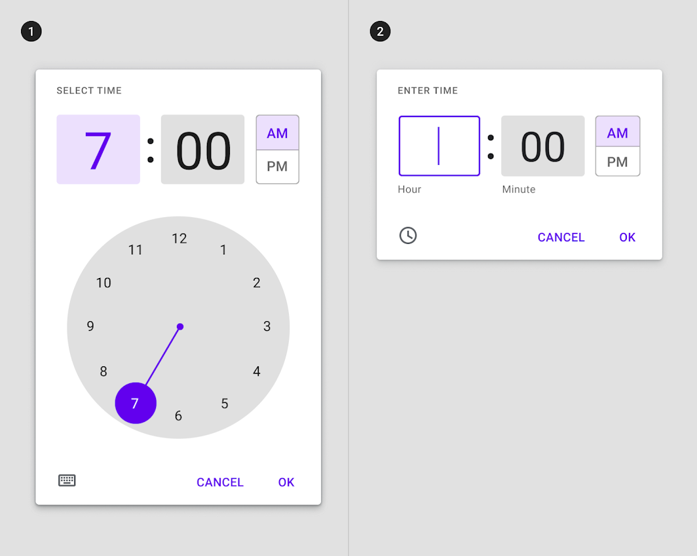
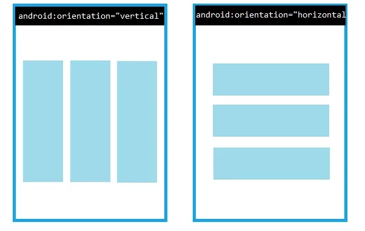

## Views

- A View occupies a rectangular area on the screen and is responsible for **drawing** and **event handling**.

- View is the base class for widgets, which are used to create interactive UI components (buttons, text fields, etc.).

- Views are called widgets

- Button,TextView,EditText ....

  - Button

    

  - ImageButton

    

  - EditText

    

  - TextView

    

  - Toast

    

  - CheckBox

    

  - RadioButton

    

  - Spinner

    

  - AutoCompleteTextView

  - ProgressBar

    

  - DatePicker

    

  - TimePicker

    

  - AlertDialog

    

  - RatingBar

    

  - WebView

    

## ViewGroups

- The ViewGroup is the base class for layouts, which are invisible containers that hold other Views (or other ViewGroups) and define their layout properties.

- Viewgroups are called layouts such as

- ConstraintLayout, LinearLayout, RelativeLayout, FrameLayout etc

  - **Relative Layout**s :
    RelativeLayout is a view group that places its child views relative to one another

    

  - **Constraint Layout**: It is similar to RelativeLayout in that all views are set up according to the relationships between sibling views and the parent layout, but it is more flexible than RelativeLayout and easier to use with the Layout Editor in Android Studio

    

  - **Frame Layout** : FrameLayout is designed to display a single object in a section of the screen
    
  - **Table Layout** :TableLayout is a ViewGroup that presents its children in rows and columns.

    
