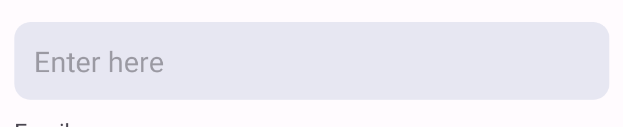

## Customzing EditText using drawable

1. Create your EditText in your layout

```xml
<LinearLayout xmlns:android="http://schemas.android.com/apk/res/android"
    android:layout_width="match_parent"
    android:layout_height="wrap_content"
    android:orientation="vertical"
    android:padding="20dp">


    <EditText
        android:layout_marginTop="10dp"
        android:id="@+id/editTextText"
        android:layout_width="match_parent"
        android:layout_height="wrap_content"
        android:layout_weight="1"
        android:ems="10"
        android:hint="Enter here"
        android:inputType="text"
        android:padding="12dp" />

    <TextView
        android:id="@+id/textView4"
        android:layout_width="match_parent"
        android:layout_height="wrap_content"
        android:layout_marginTop="10dp"
        android:layout_weight="1"
        android:text="Email" />

        </Linears->
```

2. Create **new drawable file** in drawable folder .
   This file can be applied as background to textfield or other components.

   ```xml
   <?xml version="1.0" encoding="utf-8"?>
   <selector xmlns:android="http://schemas.android.com/apk/res/android">

    <item android:state_enabled="true" android:state_focused="true">
        <shape android:shape="rectangle">
            <solid android:color="@color/white" />
            <stroke android:width="1dp" android:color="@color/black" />
            <corners android:radius="10dp" />
        </shape>
    </item>
    <item android:state_enabled="true">
        <shape android:shape="rectangle">
            <solid android:color="#E7E7F2" />
            <corners android:radius="10dp" />
        </shape>
    </item>
    </selector>

   ```

   3. Final step is to apply above drawable to your edittext or button you want.

   ```xml
    <EditText
        android:id="@+id/editTextText2"
        android:layout_width="match_parent"
        android:layout_height="wrap_content"
        android:layout_weight="1"
        android:ems="10"
        android:hint="Enter here"
        android:inputType="text"


        android:background="@drawable/custom_input_field_text"


        android:padding="12dp"
        android:layout_marginTop="10dp"

        />

   ```

   **You will get the customized output**

   
