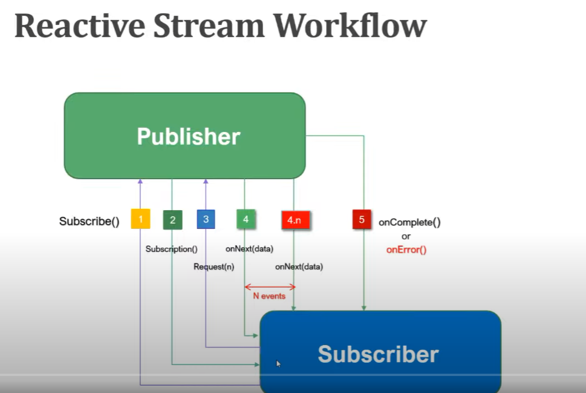

# Spring boot Reactive Programming

- Spring 5 provides Spring WebFlux which helps to create web application that helps to create reactive web applications.

## Asynchronous and non blocking

    Be can handle more request(using pub-sub model)

## Funtional Style coding

    Use more lambdas

## Data flow as event driven stream

    Data is transfer as event driven ---whenever changes happen pubhlisher publish the event

## Backpressure on data streams

Add limitation on data from database

---

## Reactive Programming

Reactive programming is a programming paradigm where the focus is on developing **_asynchronous_** and **_non-blocking_** applications in an event-driven form.

## Four Interfaces

Publisher

```java
    interface Publisher<T>
    {
            public void subsribe(Subscribe<? super T>s)
    }
```

Subsriber

```java

    interface Subsriber<>{

        onSubscribe(Subscription s)
        onNext(T t)
        onError(Throwable t)
        onComplete()

    }

```

Subscription

```java
interface Subscription{
    cancel()
    request(long var)
}

```

Processor

## Reactive stream flow



## Libraries for reactive programming

- Reactor
- RxJava
- Jdk9 Flow Reactor Stream

# Project Reactor

Project reactor is library that implements reactive specification for building non-blocking and asynchronous applications on JVM

### Implementation of Publisher

- Flux - 0...N elements

- Mono - return 0 or 1 element
